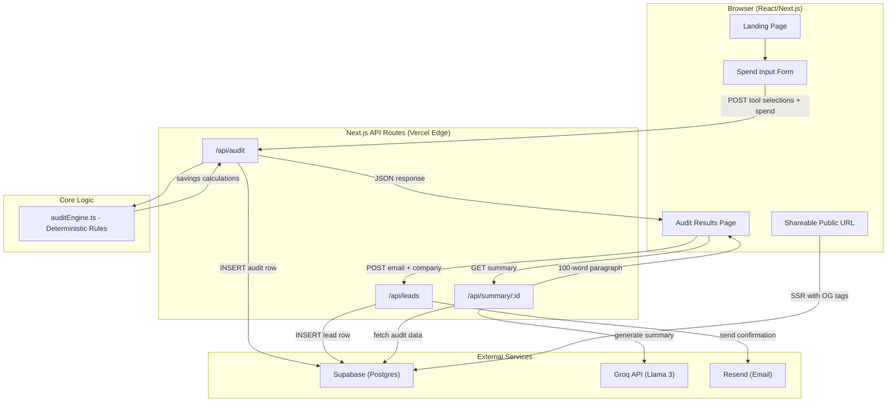
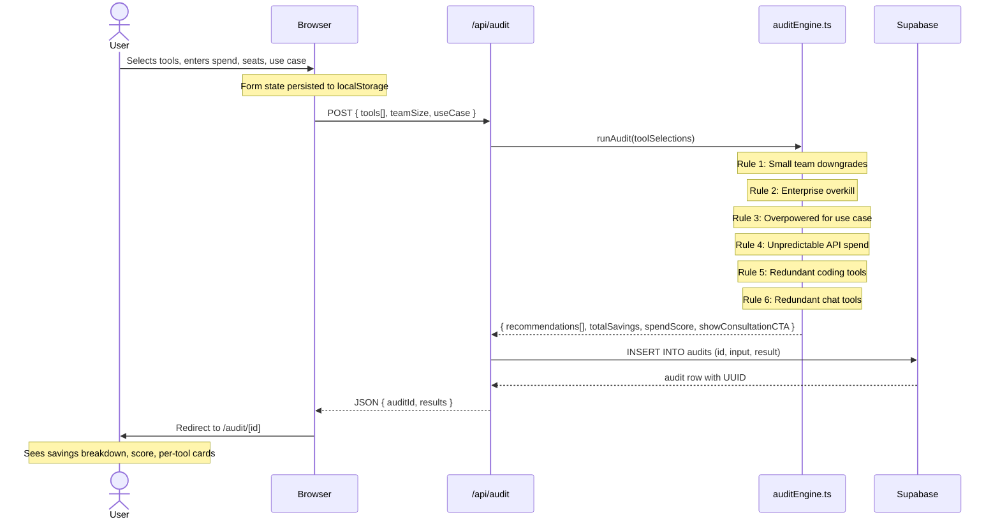

# Architecture

## System Diagram

## Data Flow: Input -> Audit Result

## How the Audit Engine Computes Advice

The Audit Engine (`src/lib/auditEngine.ts`) is a pure, deterministic function. It does not use AI or external API calls to calculate savings. Instead, it relies on hardcoded, verified pricing rules based on current market data.

Here is exactly how it computes the advice:
1. **Filtering**: It ignores any tools that are toggled off, have 0 seats, or have $0 monthly spend.
2. **Rule 1: Small Team Downgrades**: If a team has 1-2 users but is paying for a "Team" or "Business" tier (e.g., Cursor Business at $40/user, ChatGPT Team at $25/user), the engine recommends downgrading to the individual "Pro" or "Plus" tiers, which offer the necessary features for small teams at a lower cost.
3. **Rule 2: Enterprise Overkill**: If a team is ≤10 users and paying for Copilot Enterprise ($39/user), it recommends downgrading to Copilot Business ($19/user).
4. **Rule 3: Overpowered Models for Basic Tasks**: If the use case is "writing" or "research" and the user is paying for Gemini Ultra ($249.99/mo), it recommends downgrading to Gemini Pro ($19.99/mo).
5. **Rule 4: Unpredictable API Spend**: If the user is spending <$20/mo on raw OpenAI or Anthropic API, it recommends switching to the predictable $20/mo ChatGPT Plus or Claude Pro subscriptions to avoid surprise bills.
6. **Rule 5: Redundant Coding Tools**: If the user is paying for multiple coding assistants (e.g., Cursor, Copilot, Windsurf), it recommends keeping the most expensive one (assuming it's their primary tool) and dropping the others to consolidate spend.
7. **Rule 6: Redundant Chat Tools**: If the user is paying for multiple general chat assistants (e.g., ChatGPT and Claude), it recommends keeping Claude for coding use cases, ChatGPT for writing use cases, and dropping the other.

## Why This Stack

| Choice | Why |
|---|---|
| **Next.js 15 (App Router)** | Server-side rendering for the shareable audit pages gives proper Open Graph meta tags, critical for the viral loop. API routes colocate backend logic without a separate server. Vercel deploys in seconds. |
| **TypeScript** | The audit engine has complex branching logic across tool types and pricing tiers. Static types catch mismatches (e.g., passing a `string` where a `number` is expected for spend) before they become wrong savings calculations shown to users. |
| **Supabase (Postgres)** | Free tier covers the MVP easily. Row-level security is available if needed later. Direct SQL access for analytics. Chose over Firebase because audit data is relational (audits -> leads is a natural FK relationship). |
| **Groq API (Llama 3)** | Fastest inference for the AI summary feature, sub-second responses vs. 3-5s from OpenAI/Anthropic. Free tier is generous. The summary is non-critical (templated fallback exists), so using a fast/cheap provider is the right trade-off. |
| **Resend** | for email sending. |
| **shadcn/ui** | Accessible, unstyled primitives that don't fight custom design. No runtime CSS overhead like MUI. Components are copied into the repo, no version lock-in. |
| **Vitest** | Near-instant test execution. Compatible with TypeScript out of the box. The audit engine tests run in <500ms, which keeps CI fast. |

## What I'd Change at 10,000 Audits/Day

At ~10k audits/day (~7 per minute), the current architecture would hit several bottlenecks:

### Database
- **Now:** Every audit is a single Supabase INSERT. At 7/min this is fine.
- **At scale:** Add connection pooling (PgBouncer, already available in Supabase). Add an index on `audits.created_at` for analytics queries. Consider partitioning the audits table by month if historical data grows large.

### Audit Engine
- **Now:** Runs synchronously in the API route. Pure function, no I/O, fast enough.
- **At scale:** Still fine, it's a pure CPU function with no external calls. The bottleneck is never the engine itself. If pricing rules grow complex, extract them into a config file rather than hardcoded conditionals.

### AI Summary
- **Now:** One Groq API call per audit view. If Groq is down, falls back to a template.
- **At scale:** Cache generated summaries in the database after first generation. 10k audits/day x one summary each = 10k API calls/day. With caching, repeat views (shared URLs) hit zero API calls. Add a queue (Inngest or Vercel Cron) for batch generation if latency spikes.

### Email
- **Now:** Gmail SMTP, ~500/day limit.
- **At scale:** Immediately switch to a transactional email provider like Postmark ($1.25/1k emails) or AWS SES ($0.10/1k). Add a dead-letter queue for failed sends. Rate-limit to prevent abuse.

### Infrastructure
- **Now:** Single Vercel deployment, serverless functions.
- **At scale:** Vercel handles horizontal scaling automatically for API routes. Add Redis (Upstash) for rate limiting per IP. Add Cloudflare in front for DDoS protection. Move to ISR (Incremental Static Regeneration) for popular shared audit pages to reduce DB reads.

### Monitoring
- **Now:** Console logs and Vercel's built-in analytics.
- **At scale:** Add Sentry for error tracking, PostHog for product analytics (funnel: audit completed -> email captured -> consultation booked), and Supabase's pg_stat_statements for slow query detection.

## Folder Structure

### `src/` (Source Code)
*   **`app/`**: Next.js App Router structure.
    *   `page.tsx`: The main landing page with the interactive tool selection form. It saves state to `localStorage` so users don't lose their progress.
    *   `layout.tsx`: Global HTML structure and font loading.
    *   `globals.css`: Tailwind CSS entry point and global styles.
    *   `audit/[id]/page.tsx`: Server component that fetches audit data from Supabase and generates Open Graph metadata for public link sharing (e.g., on Twitter/Slack).
    *   `audit/[id]/client.tsx`: Client component that renders the interactive audit results, the AI Spend Score, and the lead capture form.
    *   `api/audit/route.ts`: API endpoint that receives form data, runs the `auditEngine`, generates a unique ID, saves the audit to Supabase, and returns the result.
    *   `api/leads/route.ts`: API endpoint that processes the lead capture form, saves the lead to Supabase, and triggers the confirmation email.
    *   `api/summary/[id]/route.ts`: API endpoint that uses the Groq API to generate a personalized ~100-word summary of the audit.
*   **`components/`**
    *   `ui/`: Reusable shadcn/ui components (e.g., Button).
    *   `LeadCaptureForm.tsx`: The form component for capturing emails on the results page. Includes a honeypot field for bot/spam protection.
*   **`lib/`**
    *   `auditEngine.ts`: The core business logic for calculating savings (described above).
    *   `email.ts`: Helper to send transactional emails using Resend.
    *   `groq.ts`: Helper to interface with the Groq API for AI summaries, including a fallback template if the API fails or the key is missing.
    *   `supabase.ts`: Supabase client initialization (lazy-loaded to prevent Next.js build errors if environment variables are missing).
    *   `types.ts`: TypeScript interfaces used across the entire application.
*   **`tests/`**
    *   `auditEngine.test.ts`: Vitest test suite to ensure the audit engine rules calculate savings correctly and don't break during refactors.

### Root Directory Files
*   `PRICING_DATA.md`: Documentation of the verified, up-to-date pricing for all AI tools used in the engine.
*   `PROMPTS.md`: Documentation of the prompts used for the Groq AI summary generation and the reasoning behind them.
*   `DEVLOG.md`: Daily log of the work done on the project (as required by the assignment).
*   `supabase/schema.sql`: SQL commands to create the required database tables (`audits`, `leads`) in your Supabase project.
*   `.github/workflows/ci.yml`: GitHub Actions workflow to run linting and Vitest regression tests on every push.
